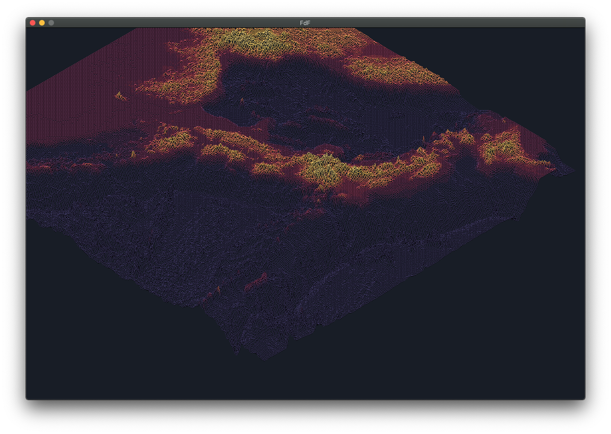

# FDF

> Fil De Fer (ie: Wireframe)

Project a 2d array into the 3rd dimension.

The column is the `x`, the line is the `y` and the value is the `z`.

```sh
./fdf test.fdf
```

|            File            |              Render                 |
|----------------------------|-------------------------------------|
|  |  |


## Showcase
### Render huge maps with million of points


### Beautiful color scheme


### Isometric and Parallel projection


### Movable camera and angle


## Install
One of the requirement of this project was to use [42l's minilibX](https://github.com/pbondoer/MinilibX) which only run easily on the school's mac.

Could be done on Linux but you're on your own.

So make sure you have :
- MacOS
- 42's MinilibX

Then :
``` sh
git clone ssh://git@git.42l.fr:42084/Fabien/fdf.git
cd fdf
make
```

## How it's done

```c
// What minilibX look like :
// Only mlx_* function are from the minilibX
void	draw_win(t_fdf *fdf)
{
	mlx_clear_window(fdf->mlx.mlx, fdf->mlx.window);
	clear_image(&fdf->mlx, fdf->disp.bg_color);
	draw_fdf(fdf);
	if (!fdf->flag.disp_helper)
		draw_usage_bg(fdf, fdf->disp.usage_color);
	mlx_put_image_to_window(fdf->mlx.mlx, fdf->mlx.window, fdf->mlx.image,
		0, 0);
	if (!fdf->flag.disp_helper)
		draw_helper(fdf, fdf->disp.text_color);
}
```

For the projection the goal is to plot a 3d point on a 2d plane (the screen).

To do it, all you need to know is basic trigonometry and a good understanding of its implications.

We've only used the `sin` and `cos` function for this.


For example, for this parallel projection with a projection angle of `r` :


| Point |   3d    |          2d          |
|:-----:|:-------:|:--------------------:|
|   A   | 0, 0, 0 | 0, 0                 |
|   B   | 1, 0, 0 | 1, 0                 |
|   C   | 1, 1, 0 | 1, 1                 |
|   D   | 1, 0, 1 | `cos(r) + 1, sin(r)` |
|   E   | 0, 0, 1 | `cos(r), sin(r)`     |

So for one degree of projection we get :
```
destination.x = source.x + cos(angle) * source.z
destination.y = source.y + sin(angle) * source.z
```

And for an isometric projection it is the same thought-process.
```
destination.x = source.x + cos(angle) * source.z - cos(angle) * source.y
destination.y = -source.y * sin(angle) - source.z * sin(angle)
```

Once we get all the coordinate we properly offset and scale them properly on the screen.
So in a 1000x1000 window [0, 0] may be at [500, 500] and [1, 1] at [550, 550] for example.

Then we draw all the lines. For this Pascal used [Bresenham's line algorithm](https://en.wikipedia.org/wiki/Bresenham%27s_line_algorithm) but another simpler (be it less pretty) could have been used, like [Linear interpolation](https://en.wikipedia.org/wiki/Linear_interpolation). Bresenham is said to give the best result. 

## Credit
Student project for School [42](https://www.42.fr/).

Realized as a group with Pfragnou.

Final Grade: 125/125
